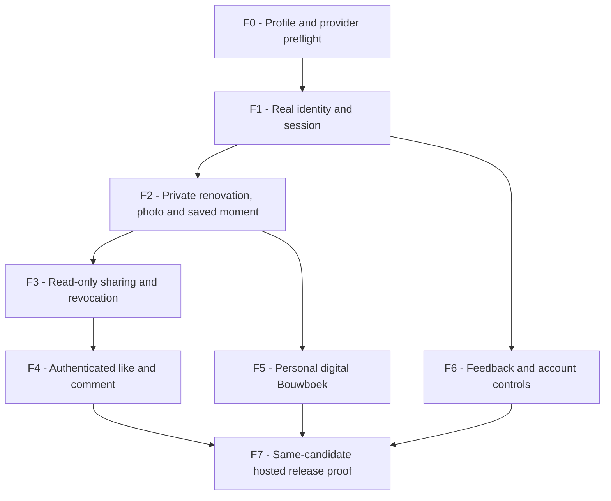

# Core flows and verification

These are **target behavior**, not claims that the hosted app passes.
Use [GRAPH](GRAPH.md) node IDs; record actual results only in [STATE](STATE.md).

## Implementation order

Work in one vertical slice. The graph is a work-order map, not a runtime orchestration framework.
Do not open a new product workstream while the current slice has an unresolved data/access failure.

## Flow contracts

| ID / nodes | Observable success | Required negative check |
| --- | --- | --- |
| F0 / C,H,D | Identify source SHA, deployed SHA/profile, safe isolated Preview and required DB/PII/core config names. Password auth has no OAuth-secret or callback dependency. Distinguish `disabled`, `unconfigured` and proven functionality. | Missing identity configuration never opens writes or creates fake sessions. No production data used for Preview fixtures. |
| F1 / U,H,A,D | Owner registers with username/password without an email field, receives one account, reloads, logs out and logs back into the same identity. | Reject invalid input, wrong passwords, duplicate usernames and cross-origin mutations; limit repeated attempts. Logged-out sessions cannot edit. Mocked sign-in is not a real hosted account test; existing external identities are not silently linked. |
| F2 / U,H,A,P,M,D | Owner creates a private renovation, saves photo/date/text, reloads, edits and sees the same persisted moment. | Outsider cannot write/read private data; corrupt image is rejected; upload retry preserves text and does not duplicate the moment. |
| F3 / U,H,A,S,P,M,D | Owner creates a link; isolated visitor reads the story and permitted media without editor controls; owner revokes it. | Old link no longer authorizes page/API/media reads. Revocation cannot erase bytes already downloaded; do not promise that. |
| F4 / U,H,A,S,E,D | A separately authenticated permitted viewer likes/unlikes and comments; counts/content survive reload; author/owner can remove allowed comments. | Viewer cannot edit the project or another user's comments. Recheck current visibility/block/link rules on every write; reject duplicate or unauthorized mutations safely. |
| F5 / U,H,A,B,P,M,D | Owner opens a digital book populated with their saved moments, changes inclusion/cover and sees it after reload. | No printer, checkout or print worker needed; no private media leak; stale/deleted content updates predictably. |
| F6 / U,H,A,L,S,M,D | Feedback persists; logout revokes session; dedicated disposable-account deletion immediately removes access and reports cleanup truthfully. | Do not delete the founder's account or other users' data. Failed physical cleanup cannot leave active links/sessions. |
| F7 / all core nodes | Real owner and viewer complete F1–F6 on one identified Preview. After approved release, deployed SHA/profile and smoke results agree. | CI green, HTTP 200, a ready capability or static book example alone cannot prove the user MVP. |

## Existing entry points for tests

These are discovery anchors, not proof of current coverage or passing results. Inspect mocks/profile selection before relying on a test.

| Slice | Start here |
| --- | --- |
| F0–F1 | [auth E2E](../../tests/e2e/auth.e2e.ts), [server tests](../../tests/server), [config](../../server/config/runtime.ts) |
| F2 | [owner E2E](../../tests/e2e/owner-renovation.e2e.ts), [photo handoff](../../tests/e2e/landing-photo-handoff.e2e.ts), [database tests](../../tests/db) |
| F3–F4 | [sharing E2E](../../tests/e2e/project-share-link.e2e.ts), [project E2E](../../tests/e2e/project-detail.e2e.ts), [follow regression](../../tests/e2e/friends-follow.e2e.ts) |
| F5 | [Bouwboek E2E](../../tests/e2e/photobook.e2e.ts), [photobooks implementation](../../server/photobooks) |
| F6 | [support E2E](../../tests/e2e/public-support.e2e.ts), [account implementation](../../server/account), [database tests](../../tests/db) |
| F7 | [Playwright config](../../playwright.config.ts), [current CI](../../.github/workflows/ci.yml), [scripts](../../package.json) |

Use targeted regression tests while fixing a slice; keep required CI and security checks before integration/release. Do not expand the browser matrix or add a new test framework just for these documents.
For auth/access/database changes, include real PostgreSQL tests. For a product release, use actual hosted APIs/storage and permitted owner/viewer sessions, not broad route mocks.

## Two-user acceptance journey

**Owner:** register with username/password → private renovation → three test photos over two moments → reload → edit → share → personal digital Bouwboek → feedback → logout/login into the same account.
**Viewer:** redeem link → read without edit rights → separately authenticate → like/comment → reload. Owner revokes the link; verify link-derived API and media access are denied.
Keep test accounts isolated and clean only records created by the test. A viewer with another valid access path may still have access: prove which authorization path was revoked.
Profile following uses the existing profile graph only. Verify relevant follower-removal/block rules when this access path is exposed; do not add a second social system or broad feed to complete the journey.

## Evidence discipline

Record `flow ID | result | source SHA | environment/profile | UTC time | command or action | mock/real-provider boundary | evidence reference`.
Use `PASS`, `FAIL`, `BLOCKED` or `NOT_RUN`. Tests may be PASS while hosted status remains BLOCKED.
Any source/config/access change affecting a recorded result requires rechecking that result. Mark old evidence stale rather than silently copying green checkmarks.
Use Playwright CLI/API and owner-performed personal login. No Computer Use and no test-auth bypass in production. A tool name is not proof.

If blocked externally, record the exact missing setting and one owner action.
The owner has authorized username/password auth; absent Google secrets are no
longer a blocker. Preserve the remaining database, private Blob and hosted
verification boundaries. Password recovery is not part of this implementation.
