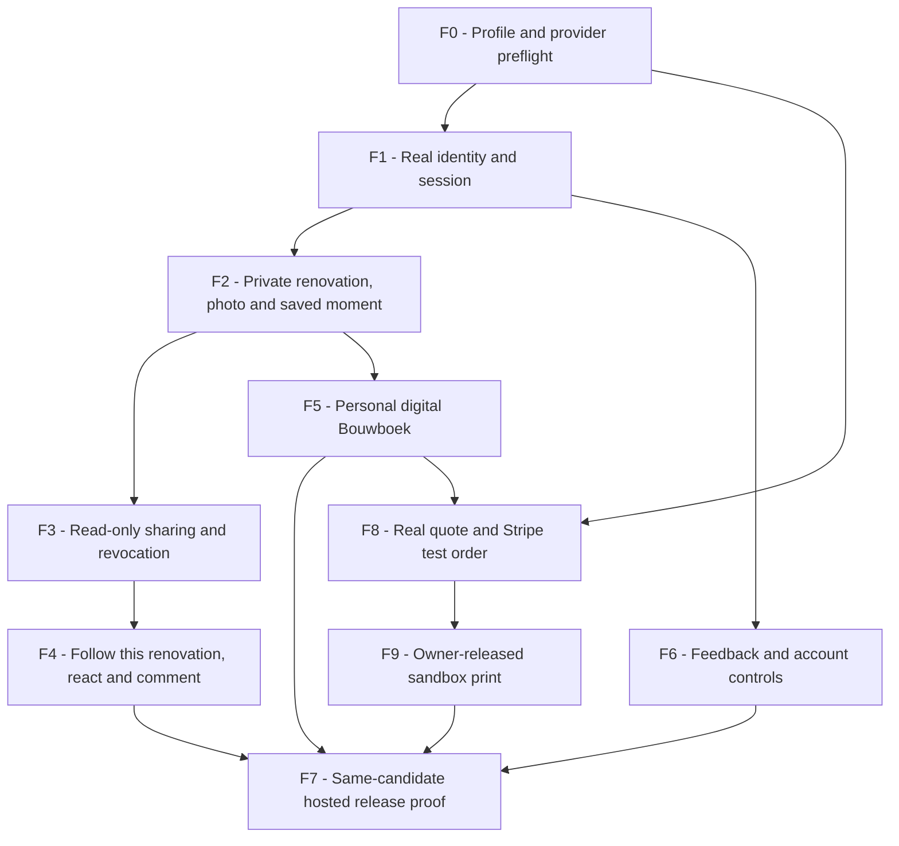

# Core flows and verification

These are **target behavior**, not claims that the hosted app passes.
Use [GRAPH](GRAPH.md) node IDs; record actual results only in [STATE](STATE.md).

## Implementation order

```mermaid
flowchart TD
  F0["F0 - Profile and provider preflight"] --> F1["F1 - Real identity and session"]
  F1 --> F2["F2 - Private renovation, photo and saved moment"]
  F2 --> F3["F3 - Read-only sharing and revocation"]
  F3 --> F4["F4 - Follow this renovation, react and comment"]
  F2 --> F5["F5 - Personal digital Bouwboek"]
  F1 --> F6["F6 - Feedback and account controls"]
  F4 --> F7["F7 - Same-candidate hosted release proof"]
  F5 --> F7
  F6 --> F7
  F0 --> F8["F8 - Real quote and Stripe test order"]
  F5 --> F8
  F8 --> F9["F9 - Owner-released sandbox print"]
  F9 --> F7
```

Work in one vertical slice. The graph is a work-order map, not a runtime orchestration framework.
Do not open a new product workstream while the current slice has an unresolved data/access failure.
The owner deferred Peecho company details: finish the account app independently. F0's real quotes still precede connecting payments. `CHECKOUT_MODE=off` remains current; F8/F9 are gated targets, not active commerce or evidence.
F0 still records required DB/PII/core configuration names and distinguishes disabled, unconfigured and proved capabilities. Password auth has no OAuth-secret or callback dependency.

## Flow contracts

| ID / nodes | Observable success | Required negative check |
| --- | --- | --- |
| F0 / C,H,D,Q | Identify current source/deployed SHA/profile and isolated Preview; check Neon, private Blob, Peecho and Stripe access early. Prove one available account-specific hardcover (prefer matching A4 landscape), NL/EUR/one copy, with three valid page-count quotes. Record environment, dimensions, page limits/steps and counting/cover rules, raw costs/currency/tax/shipping and UTC time. | No example product IDs or guessed units/tax. Keep test/live credentials and product references separate; sandbox quotes do not prove live costs. Missing access blocks the payment slice, never opens auth or creates fake sessions. No production data in Preview fixtures. |
| F1 / U,H,A,D | Owner registers with username/password without an email field, receives one account, reloads, logs out and logs back into the same identity. | Reject invalid input, wrong passwords, duplicate usernames and cross-origin mutations; limit repeated attempts. Logged-out sessions cannot edit. Mocked sign-in is not a real hosted account test; existing external identities are not silently linked. |
| F2 / U,H,A,P,M,D | Owner creates a private renovation, saves photo/date/text, reloads, edits and sees the same persisted moment. | Outsider cannot write/read private data; corrupt image is rejected; upload retry preserves text and does not duplicate the moment. |
| F3 / U,H,A,S,P,M,D | Owner creates a link; isolated visitor reads the story and permitted media without editor controls; owner revokes it. | Old link no longer authorizes page/API/media reads. Revocation cannot erase bytes already downloaded; do not promise that. |
| F4 / U,H,A,S,E,D | A separately authenticated permitted viewer follows the specific renovation, uses a small reaction set and plain-text comments; target/counts/content survive reload; author/owner can remove allowed comments. | Viewer cannot edit the project or another user's comments. No silent follow of all owner projects, competing follow system or private/share-revocation bypass. Recheck current visibility/block/link rules on every write; reject duplicates and unauthorized mutations safely. |
| F5 / U,H,A,B,P,M,D | One canonical document drives preview, page count, quote and PDF in global Bouwmoment-date order with the timeline's stable tie-breaker. Title/cover/exclusions persist. Keep photos/text together, continue long text, inspect portrait/landscape/crop/resolution and rendered pages. Match the selected product's page/cover/spine/margin rules; freeze the approved revision. | Test a later update in an earlier phase and a backdated moment; phases cannot reorder chronology. No truncation or automatic friends' comments. Preview and story work without checkout/print worker; a preview is not print proof. Paid files cannot change with later timeline edits or leak private media. |
| F6 / U,H,A,L,S,M,D | Feedback persists; logout revokes session; dedicated disposable-account deletion immediately removes access and reports cleanup truthfully. | Do not delete the founder's account or other users' data. Failed physical cleanup cannot leave active links/sessions. |
| F7 / all affected nodes | Prove the owner/viewer core and test ordering on an identified real Preview; record any missing live approval separately. Preserve the prior public deployment for rollback, verify current recovery resources, then release and confirm the built SHA/profile and public page. | A successful build or static preview alone proves neither the core nor printing. Never fall back to an accountless demo. Live ordering stays off until price/margin, operator, Stripe account, hosting permission and print handling are approved; no purchased plan or invented approval. |
| F8 / U,H,A,B,Q,T,O,D | After F0, server quotes the approved revision and stores destination/SKU/pages, cost basis, approved price and expiry with integer amounts/tested rounding. Existing Stripe-hosted test Checkout uses one canonical address; verified server payment creates one paid order. Margin is configurable, explicitly test-only until approval. | Browser amounts/page counts and success redirects are not proof. Check webhook signature/account/environment/order/amount/currency/payment_status, delayed methods and duplicate delivery. No guessed tax/fees/delivery or double-added shipping; stale/missing quotes block ordering only. |
| F9 / H,A,B,O,R,D | Paid order appears in existing admin with exact PDF, address and cost snapshot. Separate server-authorized owner release submits bounded synthetic sandbox print; persist external reference before payment/follow-up. Keep payment and print/shipping status distinct. | Automatic release stays off. Uncertain create/pay outcome reconciles by supported reference/status or becomes manual review; retries create no duplicate order/charge. Temporary revision file grant supports HEAD/GET/Range/retries. No real order/payment/wallet/proof without separate amount/copies/address/file approval. |

## Existing implementation and optional checks

The owner removed CI, GitHub Actions, browser matrices, coverage and database integration suites on 2026-09-27. These links help locate the affected code; they do not establish mandatory test or release gates.

| Slice | Start here |
| --- | --- |
| F0–F1 | [auth](../../server/auth), [server unit tests](../../tests/server), [config](../../server/config/runtime.ts) |
| F0 Peecho | [read-only CLI](../../scripts/setup/peecho.ts), [contract checks](../../scripts/setup/peecho-check.ts) |
| F2 | [projects](../../server/projects), [media](../../server/media) |
| F3–F4 | [sharing](../../server/projectShares), [engagement](../../server/engagement) |
| F5 | [photobooks](../../server/photobooks) |
| F6 | [account](../../server/account) |
| F7 | [manual commands](../../package.json), [Vercel build](../../vercel.json) |
| F8–F9 | [order service](../../server/orders/service.ts), [Stripe webhook unit tests](../../tests/server/stripe-payment-webhook.test.ts) |

Use a focused manual check when a change warrants it. Vercel builds the app without running test, lint or typecheck gates. Reuse recorded hosted evidence when behavior is unchanged; no repeated matrices or provider probes.

## Two-user acceptance journey

**Owner:** register with username/password → private renovation → three test photos over two moments → reload → edit → share → personal digital Bouwboek → feedback → logout/login into the same account.
**Viewer:** redeem link → read without edit rights → separately authenticate → follow this renovation → react/comment → reload. Owner revokes the link; verify link-derived API and media access are denied despite following.
Keep test accounts isolated and clean only records created by the test. A viewer with another valid access path may still have access: prove which authorization path was revoked.
Project following uses idempotent PUT/DELETE `/api/projects/:projectId/follow` and the existing `project_followers` relation. The overview returns `viewerFollowStatus`; `/api/following` includes only the selected accessible projects. Following grants no access. Existing profile connections remain separate visibility relationships; blocking/removal revokes the affected project subscriptions. Unlisted/private updates do not create durable publication notifications.
**Book/order:** mixed dates/phases, portrait/landscape and long text → matching timeline/preview/PDF → three real quotes → Stripe test payment and duplicate webhook → one paid order → owner-released sandbox request for the exact approved PDF with duplicate-action protection. Use synthetic photos; distinguish sandbox proof, live read-only quotes and an unpurchased physical proof.

## Evidence discipline

Record `flow ID | result | source SHA | environment/profile | UTC time | command or action | mock/real-provider boundary | evidence reference`.
Use `PASS`, `FAIL`, `BLOCKED` or `NOT_RUN`. Tests may be PASS while hosted status remains BLOCKED.
Any source/config/access change affecting a recorded result requires rechecking that result. Mark old evidence stale rather than silently copying green checkmarks.
Use CLI/API, Playwright or the owner's explicitly authorized Computer Use for Buildy setup. Owner performs login/MFA and secret entry that cannot be hidden from tool output. Never expose credential values or bypass production auth. A tool name is not proof.

If blocked externally, record the exact missing setting and one owner action.
The owner has authorized username/password auth; absent Google secrets are no
longer a blocker. Preserve the remaining database, private Blob and hosted
verification boundaries. Password recovery is not part of this implementation.
