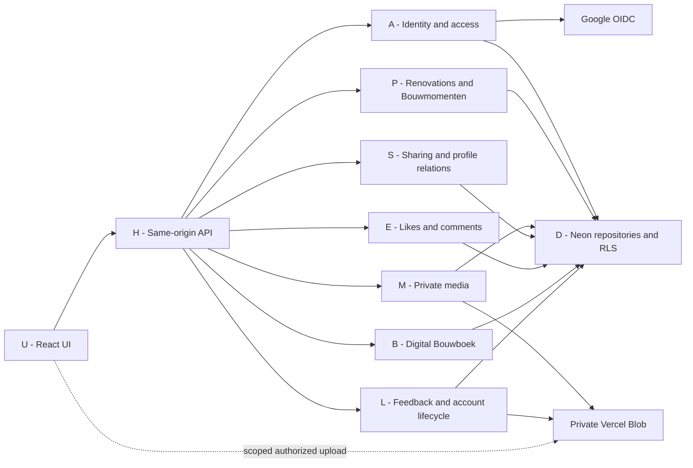

# Buildy architecture graph

**Purpose:** keep the small MVP understandable, not introduce a graph platform.
Read [STATE](STATE.md) for deployment truth and [FLOWS](FLOWS.md) for behavior/evidence.
Implementation baseline inspected: `162be48ee3c494c821d3ffe0cb19e9cbda0a4af4`.

## Product boundary

**For whom:** a homeowner documenting a renovation, plus friends/family following along.
**Promise:** Maak van je verbouwing een verhaal om te bewaren.
**Aha:** a saved photo becomes a Bouwmoment, part of the Verhaal and a Bouwboek page.
**Artifact:** a personal digital Bouwboek now; a physical keepsake later.

| Core to finish | Preserve, but not a new workstream | Outside this release |
| --- | --- | --- |
| Identity, private renovation, photos/updates, story, secure sharing, likes/comments, digital Bouwboek, feedback, deletion | Existing profile-follow and blocking rules; existing in-app notifications where already used | Stripe/Peecho, physical ordering, printproof, budget, floorplans, discovery growth, messaging, new providers |

A like/comment is real only when tied to an authenticated actor and persisted.
Keep the existing canonical profile-follow relation; do not invent a second project-follow model to satisfy copy.

## Small logical dependency map

This is the selected **feedback_beta core**, not a claim that it is deployed or a complete import graph.
An arrow means calls/depends on. The dotted arrow is the only direct browser-to-storage exception.

All protected domain calls use the server-resolved actor. B uses authorized project/media content, not a print service.
C (composition/config below) wires the nodes; D and storage adapters must not import UI.
This diagram does not instruct a refactor into new folders or classes.

## Node-to-code map

| ID | Responsibility | Existing implementation anchors |
| --- | --- | --- |
| U | Screen, local draft, typed request, loading/error state | [App](../../src/App.tsx), [LocalPhotoDemo](../../src/components/landing/LocalPhotoDemo.tsx), [API clients](../../src/lib) |
| H | Route dispatch, input/origin checks, safe response | [api/router.ts](../../api/router.ts), [HTTP router](../../server/http/router.ts), [contracts](../../shared/contracts) |
| C | Profile/capability selection and service wiring | [runtime config](../../server/config/runtime.ts), [composition](../../server/composition.ts) |
| A | OIDC, hashed sessions, active user/actor, authorization | [auth](../../server/auth), [project actor](../../server/projects/actor.ts), [database client](../../server/db/client.ts) |
| P | Owner-scoped project and update mutations; story reads | [NewTrip](../../src/pages/NewTrip.tsx), [TripDetail](../../src/pages/TripDetail.tsx), [ProjectService](../../server/projects/service.ts), [repository](../../server/projects/repository.ts) |
| M | Authorized upload, validation/processing, private reads | [AddStepDialog](../../src/components/AddStepDialog.tsx), [media](../../server/media), [Blob adapter](../../server/storage/vercelBlobObjectStorage.ts) |
| S | Read-only share capability; canonical profile follows/blocking | [ShareLinkRedeem](../../src/pages/ShareLinkRedeem.tsx), [projectShares](../../server/projectShares), [social](../../server/social) |
| E | Authorized, retry-safe likes/comments and counts | [engagement](../../server/engagement), [BlueprintTimeline](../../src/components/BlueprintTimeline.tsx) |
| B | Digital document from included real moments/media | [Photobook](../../src/pages/Photobook.tsx), [photobooks](../../server/photobooks) |
| L | Feedback/support; account export/deletion and bounded cleanup | [moderation](../../server/moderation), [account](../../server/account) |
| D | Data ownership, transactions, least privilege and RLS | [schema](../../db/schema), [migrations](../../db/migrations), [verification](../../db/verify.ts) |

## Data ownership

An app user owns renovations; a renovation owns Bouwmomenten; each moment references validated media belonging to that owner/renovation. Likes/comments reference an actor and a visible moment. A share capability grants read access, never ownership. The digital book references included project content; it is not a second independently owned photo collection. These are conceptual relationships over the existing schema, not instructions to create new tables.

## What exists versus what we want to run

`public_demo`: browser-local photo demonstration and example pages; authenticated app is disabled. Feedback may use the configured support backend.
`feedback_beta`: existing account-based implementation; it requires real provider configuration and hosted proof before activation.
Profile truth comes from C through `/api/product-profile`, not an independently invented Vite flag.

Current coupling to watch, not an instruction to rewrite:
- C still imports/wires planning, moderation/admin and dormant order/proof modules.
- In the inspected baseline, order-admin composition is triggered when Blob is present. The core should not need order administration; isolate only if it blocks a core flow or creates exposure.
- Media processing already uses a request-driven worker under its own database role. A worker class is not evidence of a required queue/cron.
- Account lifecycle uses its existing bounded maintenance path and separate role. Preserve immediate revocation and honest cleanup behavior.
- Digital Bouwboek must work with checkout off; physical proof/fulfilment must not become its dependency.

## Allowed dependency rules

1. UI → typed API → actor/access check → existing service/repository → database/storage.
2. UI may upload directly to private Blob only with server-authorized scope; validate/finalize before publishing.
3. Every read/write rechecks its relevant ownership, visibility, link and block rules. Invalidate private client state when access changes.
4. Core flows must not require payment, printer, email or discovery. Dormant code is not automatically safe; keep its endpoints gated.
5. Keep secrets and migration credentials out of browsers, ordinary runtime fallback, diagrams and evidence.
6. Use append-only migrations only for an actual blocker. Do not rewrite schema simply to make the graph look smaller.

## Keeping the graph useful

Use the stable IDs above in tasks and test notes. For each change name the edge, read its producer/consumer and the relevant access rule, then test that boundary and downstream visible result.
If a node or edge changes, update this map in the same PR. If only evidence changes, update STATE. Do not duplicate the map in a new document.
Example: changing photo deletion touches M, D, P, S and B; rerun the relevant F2/F3/F5/F6 checks, not an unrelated checkout suite. Changing only hero copy does not require database migration work.

Prefer removing an unnecessary active dependency over adding a new abstraction. No graph database, code generator, graph runner, agent framework or mandatory new CI job.
Keep this document around two screens of reference tables plus diagrams; link to code instead of copying implementations.
