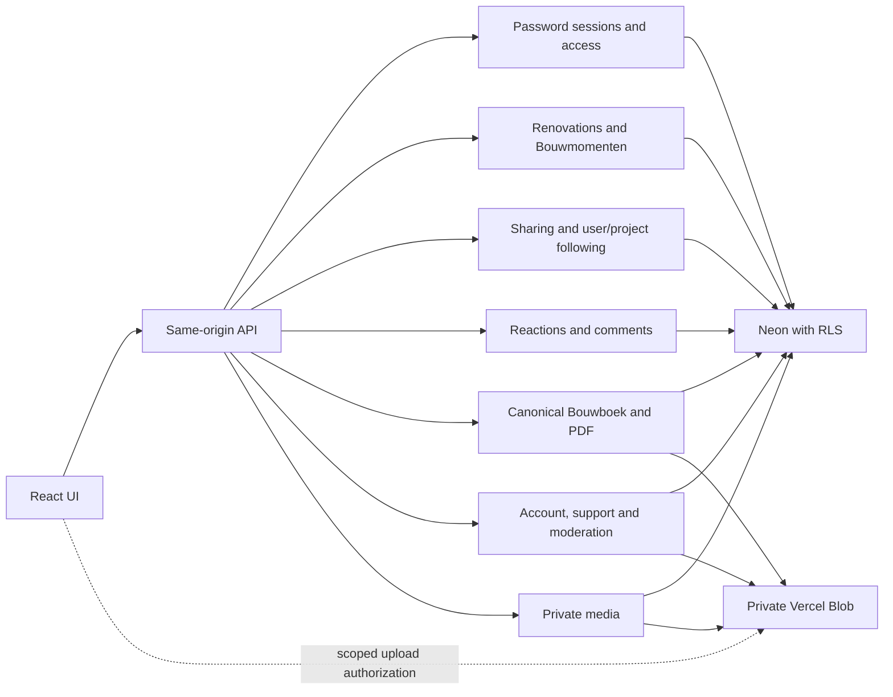

# Buildy architecture

**Maak van je verbouwing een verhaal om te bewaren.**
Scope: account → private renovation → photo/date/text Bouwmoment → chronological
story → sharing and user/project following → reactions/comments → digital Bouwboek/PDF.
[STATE](STATE.md) records deployments; [FLOWS](FLOWS.md) records behavior.

There is one account app. Budget, floorplans, discovery feeds, invitations,
OAuth, demo profiles, checkout and physical ordering have been removed.
Historical database tables and applied migrations remain intact; account
export/deletion still handles retained records. Git history contains retired code.

```mermaid
flowchart LR
  U[React UI] --> H[Same-origin API]
  H --> A[Password sessions and access]
  H --> P[Renovations and Bouwmomenten]
  H --> S[Sharing and user/project following]
  H --> E[Reactions and comments]
  H --> B[Canonical Bouwboek and PDF]
  H --> L[Account, support and moderation]
  H --> M[Private media]
  A --> D[Neon with RLS]
  P --> D
  S --> D
  E --> D
  B --> D
  L --> D
  M --> D
  M --> V[Private Vercel Blob]
  B --> V
  L --> V
  U -. scoped upload authorization .-> V
```

| Node | Existing code |
| --- | --- |
| U | [App](../../src/App.tsx), [API clients](../../src/lib) |
| H | [Vercel entry](../../api/router.ts), [router](../../server/http/router.ts), [contracts](../../shared/contracts) |
| C | [Composition](../../server/composition.ts), [core configuration](../../server/config/runtime.ts) |
| A | [Password auth](../../server/auth), [actor resolution](../../server/projects/actor.ts) |
| P | [Projects](../../server/projects), [Bouwmoment UI](../../src/components/AddStepDialog.tsx) |
| S | [Share links](../../server/projectShares), [project repository](../../server/projects/repository.ts), [user following](../../server/social) |
| E | [Engagement](../../server/engagement) |
| B | [Book UI](../../src/pages/Photobook.tsx), [canonical document](../../server/photobooks/document.ts), [PDF renderer](../../server/photobooks/pdfRenderer.ts) |
| M | [Media](../../server/media), [Blob adapter](../../server/storage/vercelBlobObjectStorage.ts) |
| L | [Accounts](../../server/account), [moderation/support](../../server/moderation), [feedback](../../server/feedbackAdmin) |
| D | [Schema](../../db/schema), [append-only migrations](../../db/migrations) |

## Boundaries

- UI → typed API → server-resolved identity/access → service/repository → data.
- Project following subscribes to one project and grants no access. Accepted
  user follows also feed accessible projects into the timeline and retain their
  existing followers-only visibility role. The two paths deduplicate; voluntary
  user-unfollow preserves independently selected projects while access remains
  valid. Owner removal, blocking and revocation apply to all content/media reads.
- Profile project lists use server-filtered public/followers projects; private
  projects and unlisted-link projects never become profile discovery results.
- Passwords use scrypt; sessions use hashed server tokens and HttpOnly cookies.
  Mutations retain origin checks, rate limits and retry-safe persistence.
- Browser uploads require scoped server authorization. No public Blob URLs or
  database credentials in the browser.
- One globally chronological document controls preview, page count and PDF.
  Request-driven media/PDF workers use separate restricted database roles.
- Account deletion revokes access immediately; bounded cleanup and export retain
  their existing data handling. No schema reset or encryption-key rotation.
- `/api/product-profile` retains compatible response fields for existing clients;
  it always describes the account app with checkout and invitations disabled.
- No CI or automated test matrix. Vercel runs the app build; focused manual
  checks are available when useful. Do not recreate release gates.
