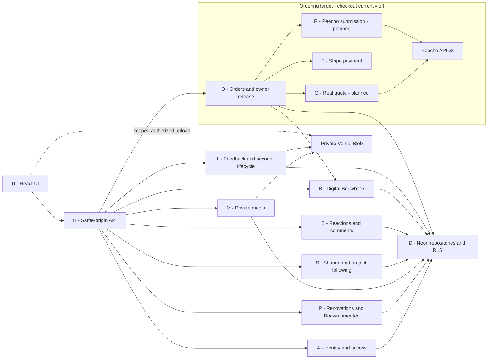

# Buildy architecture graph

**Purpose:** keep the small MVP understandable, not introduce a graph platform.
Read [STATE](STATE.md) for deployment truth and [FLOWS](FLOWS.md) for behavior/evidence.
Implementation baseline before the authorized password-auth slice:
`fb839114630efb5a7afb129a011e3b731edb972c`. See STATE for verification of changes.

## Product boundary

**For whom:** a homeowner documenting a renovation, plus friends/family following along.
**Promise:** Maak van je verbouwing een verhaal om te bewaren.
**Aha:** a saved photo becomes a Bouwmoment, part of the Verhaal and a Bouwboek page.
**Artifact:** one personal Bouwboek document for preview and print, followed by a quoted, paid, owner-released physical keepsake. These are targets, not deployment claims.

| Core to finish | Gated ordering target | Outside this release |
| --- | --- | --- |
| Identity, private renovation, photos/updates, chronological story, secure sharing, project following, small reactions/plain-text comments, canonical Bouwboek, feedback, deletion | One real Peecho hardcover and quotes → Stripe test Checkout → owner-released sandbox print; live selling only after owner approvals | Budget, floorplans, discovery growth, chat/groups, free page editor, new providers or replacement stack |

A follow/reaction/comment is real only when tied to an authenticated actor and persisted.
Following targets the selected renovation through the existing `project_followers` relation. Profile connections retain their existing visibility role; they do not subscribe the viewer to every project of an owner.

## Small logical dependency map

This is the selected **feedback_beta core** plus the gated ordering target, not a claim that commerce is implemented/deployed or a complete import graph.
An arrow means calls/depends on. The dotted arrow is the only direct browser-to-storage exception.

```mermaid
flowchart LR
  U["U - React UI"] --> H["H - Same-origin API"]
  H --> A["A - Identity and access"]
  A --> D["D - Neon repositories and RLS"]
  H --> P["P - Renovations and Bouwmomenten"]
  H --> M["M - Private media"]
  H --> S["S - Sharing and project following"]
  H --> E["E - Reactions and comments"]
  H --> B["B - Digital Bouwboek"]
  H --> L["L - Feedback and account lifecycle"]
  P --> D
  M --> D
  S --> D
  E --> D
  B --> D
  L --> D
  M --> V["Private Vercel Blob"]
  L --> V
  U -. "scoped authorized upload" .-> V
  subgraph Gated["Ordering target - checkout currently off"]
    O["O - Orders and owner release"]
    O --> Q["Q - Real quote - planned"]
    O --> T["T - Stripe payment"]
    O --> R["R - Peecho submission - planned"]
    Q --> PP["Peecho API v3"]
    R --> PP
  end
  H --> O
  O --> B
  O --> D
```

All protected domain calls use the server-resolved actor. B uses authorized project/media content, not a print service.
The order path is gated: Q must first prove an account-specific product and real quotes; T starts in test mode; R requires a separate authorized owner action after verified payment. No active Peecho quote/submission adapter is claimed.
C (composition/config below) wires the nodes; D and storage adapters must not import UI.
This diagram does not instruct a refactor into new folders or classes.

## Node-to-code map

| ID | Responsibility | Existing implementation anchors |
| --- | --- | --- |
| U | Screen, local draft, typed request, loading/error state | [App](../../src/App.tsx), [LocalPhotoDemo](../../src/components/landing/LocalPhotoDemo.tsx), [API clients](../../src/lib) |
| H | Route dispatch, input/origin checks, safe response | [api/router.ts](../../api/router.ts), [HTTP router](../../server/http/router.ts), [contracts](../../shared/contracts) |
| C | Profile/capability selection and service wiring | [runtime config](../../server/config/runtime.ts), [composition](../../server/composition.ts) |
| A | Username/password, scrypt hashes, hashed sessions, active user/actor, authorization | [auth](../../server/auth), [project actor](../../server/projects/actor.ts), [database client](../../server/db/client.ts) |
| P | Owner-scoped project and update mutations; story reads | [NewTrip](../../src/pages/NewTrip.tsx), [TripDetail](../../src/pages/TripDetail.tsx), [ProjectService](../../server/projects/service.ts), [repository](../../server/projects/repository.ts) |
| M | Authorized upload, validation/processing, private reads | [AddStepDialog](../../src/components/AddStepDialog.tsx), [media](../../server/media), [Blob adapter](../../server/storage/vercelBlobObjectStorage.ts) |
| S | Read-only sharing/blocking; project subscriptions and profile visibility connections | [ShareLinkRedeem](../../src/pages/ShareLinkRedeem.tsx), [projectShares](../../server/projectShares), [project repository](../../server/projects/repository.ts), [social](../../server/social) |
| E | Authorized, retry-safe likes/comments and counts | [engagement](../../server/engagement), [BlueprintTimeline](../../src/components/BlueprintTimeline.tsx) |
| B | One chronological document for preview/page count/PDF; approved immutable print revision | [Photobook](../../src/pages/Photobook.tsx), [document](../../server/photobooks/document.ts), [PDF renderer](../../server/photobooks/pdfRenderer.ts) |
| Q | Planned runtime Peecho quote; read-only preflight, provider interface and local matrix are not provider proof | [preflight](../../scripts/setup/peecho.ts), [quote interface](../../server/orders/types.ts), [current matrix](../../server/orders/approvedPriceMatrix.ts) |
| T | Existing hosted Checkout and verified payment webhook, gated by configuration | [payments](../../server/payments), [webhook](../../server/orders/paymentWebhook.ts) |
| O | Existing order persistence/admin; target separate owner release after verified payment | [orders](../../server/orders), [admin service](../../server/orders/adminService.ts) |
| R | Planned bounded Peecho submit/reconciliation using existing order administration; no active adapter | [admin repository](../../server/orders/adminRepository.ts), [admin types](../../server/orders/adminTypes.ts) |
| L | Feedback/support; account export/deletion and bounded cleanup | [moderation](../../server/moderation), [account](../../server/account) |
| D | Data ownership, transactions, least privilege and RLS | [schema](../../db/schema), [migrations](../../db/migrations), [verification](../../db/verify.ts) |

## Data ownership

An app user owns renovations; a renovation owns Bouwmomenten; each moment references validated media belonging to that owner/renovation. Likes/comments reference an actor and a visible moment. A share capability grants read access, never ownership. The digital book references included project content; it is not a second independently owned photo collection. These are conceptual relationships over the existing schema, not instructions to create new tables.

## What exists versus what we want to run

`public_demo`: browser-local photo demonstration and example pages; authenticated app is disabled. Feedback may use the configured support backend.
`feedback_beta`: account-based target; the owner authorized replacing Google OIDC with username/password. It requires the database, data-protection and storage configuration plus hosted proof before activation; no OAuth provider is required.
Profile truth comes from C through `/api/product-profile`, not an independently invented Vite flag.

The F1 contract uses salted Node crypto scrypt password hashes and the existing
hashed HttpOnly server sessions, origin/CSRF checks, rate limiting and safe
redirects. New username accounts collect no email. Retained external identities
are not automatically linked; password recovery is not implemented.

Current coupling to watch, not an instruction to rewrite:
- C still imports/wires planning, moderation/admin and dormant order/proof modules.
- In the inspected baseline, order-admin composition is triggered when Blob is present. The core should not need order administration; isolate only if it blocks a core flow or creates exposure.
- Media processing already uses a request-driven worker under its own database role. A worker class is not evidence of a required queue/cron.
- Account lifecycle uses its existing bounded maintenance path and separate role. Preserve immediate revocation and honest cleanup behavior.
- Digital Bouwboek must work with checkout off; physical proof/fulfilment must not become its dependency.
- Existing orders, Stripe and PDF code are reuse anchors. Peecho was retired; reconnect only after the F0 real product/quote gate. Test and production offerings/credentials are separate; sandbox prices do not validate live prices.

## Allowed dependency rules

1. UI → typed API → actor/access check → existing service/repository → database/storage. The hosted API wildcard reuses `__buildy_api_path`; H removes that reserved routing parameter before strict query validation, without accepting extra client query fields.
2. UI may upload directly to private Blob only with server-authorized scope; validate/finalize before publishing. Document CSP permits the installed SDK's `https://vercel.com/api/blob` API paths and Blob storage hosts; unrelated Vercel API paths remain blocked.
3. Every read/write rechecks its relevant ownership, visibility, link and block rules. Invalidate private client state when access changes.
4. Core flows must not require payment, printer, email or discovery. Dormant code is not automatically safe; keep its endpoints gated.
   Owner onboarding opens only on the personal start/dashboard routes, so a newly registered shared-story viewer can interact without creating a renovation.
5. Keep secrets and migration credentials out of browsers, ordinary runtime fallback, diagrams and evidence.
6. Use append-only migrations only for an actual blocker. Do not rewrite schema simply to make the graph look smaller.
7. Preview, quote and final PDF use the same canonical chronology and approved revision. No automatic inclusion of friends' comments. Provider quote expiry blocks ordering only; server-derived pricing and verified Stripe status control orders.
8. Peecho gets a temporary server-owned file grant for the paid revision, with HEAD/GET/Range/retries and bounded revocation; no permanent public files. Uncertain create/pay outcomes require reconciliation or manual review, never blind retries.
9. Live selling requires approved production pricing/margin, operator details, Stripe account, commercially permitted hosting and print handling. Owner release remains manual; paid real orders/proofs need separate explicit authorization during development.

## Keeping the graph useful

Use the stable IDs above in tasks and test notes. For each change name the edge, read its producer/consumer and the relevant access rule, then test that boundary and downstream visible result.
If a node or edge changes, update this map in the same PR. If only evidence changes, update STATE. Do not duplicate the map in a new document.
Example: changing photo deletion touches M, D, P, S and B; rerun the relevant F2/F3/F5/F6 checks, not an unrelated checkout suite. Changing only hero copy does not require database migration work.

Prefer removing an unnecessary active dependency over adding a new abstraction. No graph database, code generator, graph runner, agent framework or mandatory new CI job.
Keep this document around two screens of reference tables plus diagrams; link to code instead of copying implementations.
